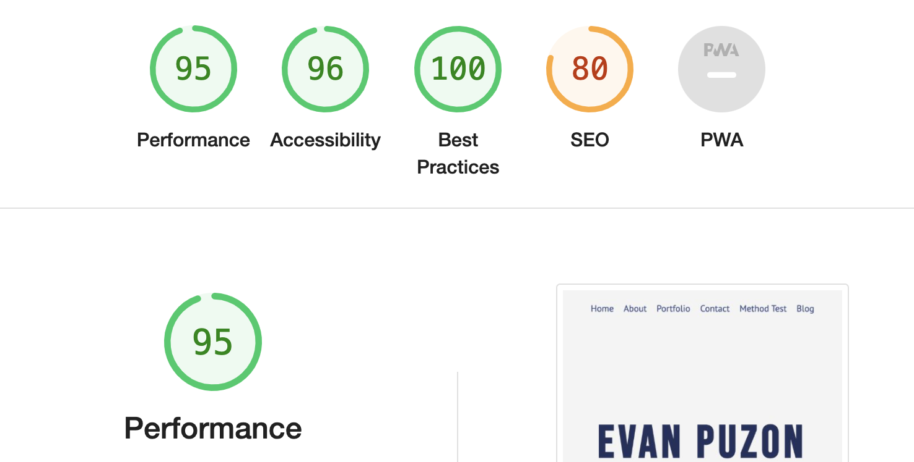

# Added Scripts
Google Analytics Data Stream

Reason - track interactions and content and such

# HW 5 
## Part 2 
### Current Lighthouse 

### Accessibility 
- Better color contrast in forms and projects list. Simple change in colors
- Proper labels for textarea elements 

### Performance 
- Set explicit image width and heights for all image tags

### Content / Design Changes
- Organize Template section for future additions 
- setup an aside for the gif pet to add 
- setup the iframe for spotify embeds

### New Lighthouse 
